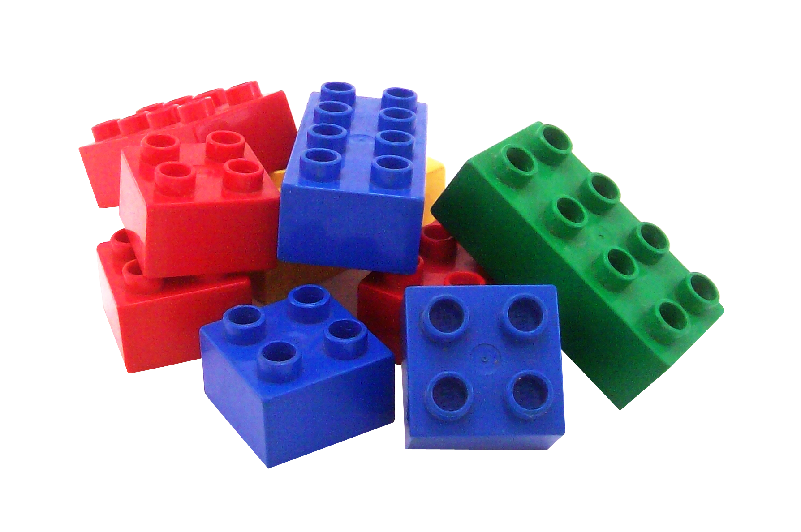

<!-- slide {class="title-slide"} -->

    <h1>Dumb and Smart Components In React.js</h1>

 
    

        

            
        

        

            <strong>Doncho Minkov</strong>
            
Senior full-stack developer

            
Software University

        

    

    

        19-Sep-2018
    

<!-- slide {class="who-am-i" style=""} -->
# Who am I?

    

        <h2>Doncho Minkov</h2>
        <ul>
            <li>
                Senior full-stack developer & trainer
                <ul>
                    <li>
                        @ Software University
                    </li>
                    <li>
                        ASP.NET Core & React.js
                    </li>
                </ul>
            </li>
            <li>
                15+ years in IT
                <ul>
                    <li>
                        8+ as a technical trainer & developer
                    </li>
                    <li>
                        Front-end developer by heart
                        <ul>
                            <li>
                                Software developer by need
                            </li>
                        </ul>
                    </li>
                </ul>
            </li>
            <li>Experience with most of JS out there
                <ul>
                    <li>AngularJS, Angular, React, Node.js, etc..</li>
                </ul>
            </li>
            <li>Also Fluent in Android, .NET, Java, C++, Python</li>
            <li>Deep knowledge of Data Structures and Algorithms</li>
        </ul>
    

    

        

            
        

        <ul style="list-style-type: none; margin: 0; padding: 0; display: flex; justify-content:space-between">
            <li>
                
            </li>
            <li>
                
            </li>
            <li>
                
            </li>
            <li>
                
            </li>
            <li>
                
            </li>
            <li>
                
            </li>
        </ul>
    

<!-- slide -->
# Table of contents

<ul>
    <li class="fragment fade-in">
        Types of components in React.js
    </li>
    <li class="fragment fade-in">
        Dumb and Smart components
    </li>
    <li class="fragment fade-in">
        Live demo
    </li>
</ul>

<!-- slide -->
# Components in React.js

    
    
    

    
    

<!-- slide -->
# React Components

<h5 class=" fragment fade-in">Function Components</h5>

	

		<pre><code data-no-escape>const Todo = (props) => (
	<label>
		<input
			type="checkbox"
			value={props.todo.id}
			checked={props.todo.isDone}
		/>
		
			{props.todo.text}
		
	</label>
);</code></pre>

	<ul>
		<li class="fragment fade-in">
			Return only XML
		</li>
		<li class="fragment fade-in">
	        Use only props
		</li>
		<li class="fragment fade-in">
	        Like tags in HTML
		</li>
	</ul>

<h5 class="fragment fade-in">Class Components</h5>

	

		<pre><code>class TodoApp extends Component {
	constructor(props) {
		super(props);
		this.state = { todos: []};
	}
  
	render() {
		return ( /\* some code \*/)
	}
}</code></pre>

	<ul>
		<li class="fragment fade-in">
			`render` method that return XML, based on state
		</li>
		<li class="fragment fade-in">
			Contain the state
		</li>
		<li class="fragment fade-in">
			Like tags in HTML, but with behavior
		</li>
	</ul>

<!-- slide {class="demo-slide"}-->
# Demo
## Create a simple listing of elements

<!-- slide {class="demo-slide"}-->
# Dumb and Smart Components

<!-- slide {style="font-size: 0.85em"} -->
# The Dumb Component

<ul>
    <li class="fragment fade-in">
        In most cases Dumb components are functional components
        <ul>
            <li class="fragment fade-in">
                Except when holding UI state or lifecycle handlers
            </li>
        </ul>
    </li>
    <li class="fragment fade-in">
        They have no control over the data
        <ul>
            <li class="fragment fade-in">
                They only visualize data and use callbacks from `props`
            </li>
        </ul>
    </li>
</ul>

<pre><code>const Todo = ({id, isDone, text, onChange}) => (
	<label>
		<input type="checkbox" value={id} checked={isDone} onChange={onChange} />
	</label>
);</code></pre>

<pre><code>const TodosList = ({todos, onTodoStateChanged}) => (
	<ul className="list">
		{
			todos.map(todo => (
				<li class="list-item">
					<Todo {...todo} onChange={onTodoStateChanged} />)
				</li>
			)
		}
	</ul>
);</code></pre>

<!-- slide -->

# The Smart Component

<ul>
	<li class="fragment fade-in">
		Smart components are always classes
	</li>
	<li class="fragment fade-in">
		They control the application
		<ul>
	<li class="fragment fade-in">
				Show other components and stuff
			</li>
		</ul>
	</li>
	<li class="fragment fade-in">
		They do not contain HTML tags
		<ul>
	<li class="fragment fade-in">
				Except `div`s for wrapping other components
			</li>
		</ul>
	</li>
</ul>

<pre><code>class TodoApp extends Component {
	state = { todos: [] }
	handleTodoStateChanged(todo) { /\* handle it \*/ }
	render() {
		const { todos } = this.state;
		return (
			

				<SiderBar />
				<TodosList todos={todos} onTodoStateChanged={this.handleTodoStateChanged} />
			

		)
	}
}</code></pre>

<!-- slide -->

    

        <h3 class="title">Dumb Components</h3>
        <h3 class="title">Smart Components</h3>
    

    

        

            

                The **pretties**
            

        

        

            

                The **brains**
            

        

    

    

        

            

                **How** to present
            

        

        

            

                **What** to present
            

        

    

    

        

            

                Run only **UI logic**
            

        

        

            

                Run **business logic**
            

        

    

    

        

            

                Have only **props** and **view state**
            

        

        

            

                Have only **data state**
            

        

    

    

        

            

                **Reusable** from other components
            

        

        

            

                **Reuse** dumb components
            

        

    

    

        

            

                Known as **Presentational**
            

        

        

            

                Known as **Containers**
            

        

    

<!-- slide -->
# Demo

- Creating application using the Dumb Smart principle
  1. List TODOs by filter (done, not done)
  2. Search TODOs by name
  3. Mark TODO as done or not done
  4. Create TODO

<!-- slide -->

# Demo and Slides

[Slides](https://cdn.rawgit.com/Minkov/dev-bg-smart-dumb-components/78d04b3e/slides/index.html)
[Demo](https://github.com/Minkov/dev-bg-smart-dumb-components)

<!-- slide {class="title-slide"} -->

    <h1>Questions</h1>

	<h2>Dumb and Smart Components In React.js</h2>

 
    

        

            
        

        

            <strong>Doncho Minkov</strong>
            
Senior full-stack developer

            
Software University

        

    

    

        19-Sep-2018
    

